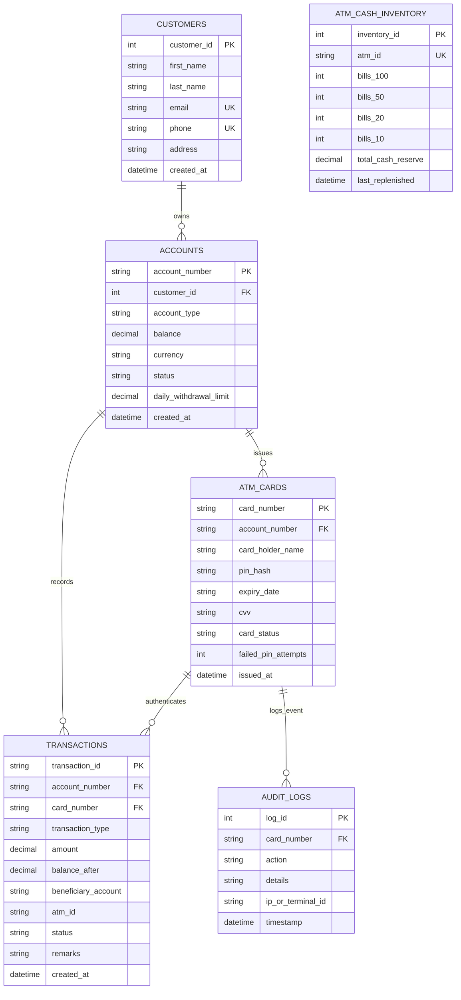

# ATM Transaction Simulation System - Database Design Specification

## 1. System Overview
The **ATM Transaction Simulation System** database provides a secure, relational, ACID-compliant storage backend for banking operations. It is designed to model the relationship between bank customers, depository accounts, authentication cards, cash inventory dispensers, and transaction audit trails.

---

## 2. Entity-Relationship Diagram (ERD)

---

## 3. Data Dictionary

### Table: `customers`
| Column Name | Data Type | Constraint | Description |
| :--- | :--- | :--- | :--- |
| `customer_id` | INTEGER | PK, Auto Increment | Unique customer identifier |
| `first_name` | VARCHAR(50) | NOT NULL | Customer given name |
| `last_name` | VARCHAR(50) | NOT NULL | Customer family surname |
| `email` | VARCHAR(100) | NOT NULL, UNIQUE | Contact email address |
| `phone` | VARCHAR(20) | NOT NULL, UNIQUE | Primary mobile/phone number |
| `address` | VARCHAR(255) | NULLABLE | Residential postal address |
| `created_at` | DATETIME | DEFAULT NOW | Record creation timestamp |

### Table: `accounts`
| Column Name | Data Type | Constraint | Description |
| :--- | :--- | :--- | :--- |
| `account_number` | VARCHAR(20) | PK | Unique account number (e.g., ACC-1001-8842) |
| `customer_id` | INTEGER | FK -> customers | Owner of the bank account |
| `account_type` | VARCHAR(20) | CHECK (SAVINGS, CHECKING, CURRENT) | Classification of bank account |
| `balance` | DECIMAL(12, 2)| NOT NULL, CHECK (balance >= 0) | Real-time cleared balance |
| `currency` | VARCHAR(3) | DEFAULT 'USD' | ISO-4217 Currency Code |
| `status` | VARCHAR(20) | CHECK (ACTIVE, FROZEN, CLOSED) | Operating state of the account |
| `daily_withdrawal_limit` | DECIMAL(10, 2) | DEFAULT 1000.00 | Maximum cash allowed per calendar day |
| `created_at` | DATETIME | DEFAULT NOW | Opening timestamp |

### Table: `atm_cards`
| Column Name | Data Type | Constraint | Description |
| :--- | :--- | :--- | :--- |
| `card_number` | VARCHAR(16) | PK | 16-digit PAN (Primary Account Number) |
| `account_number` | VARCHAR(20) | FK -> accounts | Primary debit account linked to card |
| `card_holder_name` | VARCHAR(100)| NOT NULL | Name embossed on card |
| `pin_hash` | VARCHAR(64) | NOT NULL (SHA-256) | One-way cryptographic hash of 4-digit PIN |
| `expiry_date` | VARCHAR(7) | NOT NULL | Validity expiration in MM/YYYY format |
| `cvv` | VARCHAR(3) | NOT NULL | 3-digit card verification value |
| `card_status` | VARCHAR(20) | CHECK (ACTIVE, BLOCKED, EXPIRED) | Operational state of card |
| `failed_pin_attempts` | INTEGER | DEFAULT 0, CHECK (>= 0) | Consecutive invalid PIN counter |
| `issued_at` | DATETIME | DEFAULT NOW | Card issuance timestamp |

### Table: `transactions`
| Column Name | Data Type | Constraint | Description |
| :--- | :--- | :--- | :--- |
| `transaction_id` | VARCHAR(36) | PK | Unique UUID v4 transaction tracking number |
| `account_number` | VARCHAR(20) | FK -> accounts | Debited or credited account |
| `card_number` | VARCHAR(16) | FK -> atm_cards | Card used to authorize transaction |
| `transaction_type` | VARCHAR(30) | CHECK (WITHDRAWAL, DEPOSIT, etc.) | Operation classification |
| `amount` | DECIMAL(12, 2)| CHECK (amount >= 0) | Transaction monetary magnitude |
| `balance_after` | DECIMAL(12, 2)| NOT NULL | Snapshot balance immediately following event |
| `beneficiary_account`| VARCHAR(20) | NULLABLE | Recipient account for inter-account transfers |
| `atm_id` | VARCHAR(20) | DEFAULT 'ATM-TERMINAL-01'| Physical machine terminal identifier |
| `status` | VARCHAR(20) | CHECK (SUCCESS, FAILED, REVERSED)| Execution resolution status |
| `remarks` | VARCHAR(255) | NULLABLE | Human-readable memo / description |
| `created_at` | DATETIME | DEFAULT NOW | Timestamp of execution |

### Table: `atm_cash_inventory`
| Column Name | Data Type | Constraint | Description |
| :--- | :--- | :--- | :--- |
| `inventory_id` | INTEGER | PK, Auto Increment | Hardware tracking identifier |
| `atm_id` | VARCHAR(20) | UNIQUE, NOT NULL | Terminal identity code |
| `bills_100` | INTEGER | NOT NULL, CHECK (>= 0) | Count of $100 physical banknotes in hopper |
| `bills_50` | INTEGER | NOT NULL, CHECK (>= 0) | Count of $50 physical banknotes in hopper |
| `bills_20` | INTEGER | NOT NULL, CHECK (>= 0) | Count of $20 physical banknotes in hopper |
| `bills_10` | INTEGER | NOT NULL, CHECK (>= 0) | Count of $10 physical banknotes in hopper |
| `total_cash_reserve` | DECIMAL(12, 2)| Computed / Verified | Sum total cash available in machine |
| `last_replenished` | DATETIME | DEFAULT NOW | Maintenance servicing timestamp |

### Table: `audit_logs`
| Column Name | Data Type | Constraint | Description |
| :--- | :--- | :--- | :--- |
| `log_id` | INTEGER | PK, Auto Increment | Unique log sequence key |
| `card_number` | VARCHAR(16) | NULLABLE | Associated card number (if recognized) |
| `action` | VARCHAR(50) | NOT NULL | Action (e.g. CARD_INSERTED, PIN_FAILED) |
| `details` | VARCHAR(255) | NOT NULL | Detailed contextual log |
| `ip_or_terminal_id` | VARCHAR(30) | DEFAULT 'ATM-TERMINAL-01'| Source hardware identity |
| `timestamp` | DATETIME | DEFAULT NOW | High-resolution timestamp |

---

## 4. Normalization Analysis

1. **First Normal Form (1NF)**:
   - All attribute values are atomic (no repeating groups, comma-separated lists, or composite multi-valued attributes).
   - Each table possesses a designated unique Primary Key.

2. **Second Normal Form (2NF)**:
   - The schema satisfies 1NF.
   - All non-key attributes are fully functionally dependent on the entire primary key (no partial dependencies on composite keys).
   - In `transactions`, details like customer name and card expiration are referenced via Foreign Keys rather than duplicated.

3. **Third Normal Form (3NF)**:
   - The schema satisfies 2NF.
   - There are no transitive dependencies: non-key attributes do not determine other non-key attributes.
   - For example, account balances and customer addresses reside in their respective entity relations, preventing update anomalies.

---

## 5. ACID Transactions in ATM Operations
- **Atomicity**: During a cash withdrawal or fund transfer, both the balance adjustment and transaction insertion must succeed together. If cash dispensing fails, the database transaction rolls back completely.
- **Consistency**: Invariants such as `balance >= 0` and total ATM cash decrement matching the customer debit are enforced through database CHECK constraints and business logic validations.
- **Isolation**: Concurrent access to the same account from multiple terminals is serialized to prevent double-spending anomalies.
- **Durability**: Once a transaction is committed, the updated balance and transaction ledger record remain permanently persisted.
